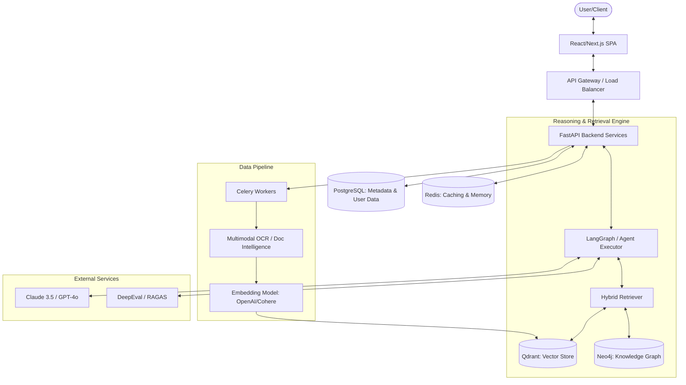

# AI Legal Adviser: Production Architecture Design

This document outlines the architecture for a production-grade AI Legal Adviser platform. The design focuses on reliability, citation grounding, hallucination prevention, and scalability.

## 1. High-Level Architecture

The system follows a modern AI-agentic pattern with a focus on "Compound AI Systems".



---

## 2. Microservice Architecture

To ensure scalability and independent deployment, the system is decomposed into several core services:

| Service | Responsibility | Tech Stack |
| :--- | :--- | :--- |
| **Identity Service** | Auth, RBAC, API Keys | FastAPI, PostgreSQL, JWT |
| **Ingestion Service** | Document processing, OCR, Chunking | FastAPI, Unstructured.io, Tesseract |
| **Knowledge Service** | Embedding generation, Vector & Graph updates | FastAPI, Qdrant, Neo4j |
| **Reasoning Service** | LLM Orchestration, RAG flow, Streaming | FastAPI, LangGraph, GPT-4o/Claude |
| **Evaluation Service** | Real-time guardrails, Offline RAG evaluation | Python, Ragas, DeepEval |
| **Analytics Service** | Usage tracking, Token counting, Feedback | ClickHouse / Postgres |

---

## 3. Request Flow (Query Lifecycle)

1.  **Entry:** User sends a query via WebSocket or SSE for streaming.
2.  **Preprocessing:** Query is cleaned and "decomposed" into sub-questions if complex.
3.  **Hybrid Retrieval:**
    *   **Dense Search:** Qdrant (Vector) retrieves semantically similar chunks.
    *   **Keyword Search:** BM25 search for exact legal terminology.
    *   **Graph Retrieval:** Neo4j traverses relationships (e.g., "Case A cites Statute B").
4.  **Reranking:** A Cross-Encoder (e.g., BGE-Reranker) scores the top 50 results to select the best 5-10 context chunks.
5.  **Grounding & Synthesis:**
    *   LLM is prompted with strict instructions: "Answer ONLY using provided context. Cite using [Source ID]."
    *   System performs a "hallucination check" before streaming (NLI-based consistency check).
6.  **Streaming:** Response is streamed to the user with UI-rendered citations.

---

## 4. Folder Structure (Monorepo Approach)

```text
legal-ai-platform/
├── apps/
│   ├── web/                # React/Next.js Frontend
│   └── api/                # Main FastAPI Gateway
├── services/
│   ├── ingestion/          # Celery workers for PDF/OCR
│   ├── retrieval/          # Search & RAG logic
│   └── eval/               # Evaluation pipelines
├── packages/
│   ├── shared/             # Shared schemas & utilities
│   ├── database/           # Prisma/SQLAlchemy models
│   └── ai-engine/          # Custom LangGraph nodes & chains
├── docker/                 # Dockerfiles & Compose
└── infra/                  # Terraform / K8s manifests
```

---

## 5. Database Schema

### PostgreSQL (Relational Data)
*   `Users`: id, email, role, preferences.
*   `Documents`: id, name, type, storage_url, status (processing/ready).
*   `Citations`: id, document_id, page_number, content_hash, metadata.
*   `Conversations`: id, user_id, title, created_at.
*   `Messages`: id, conversation_id, role, content, citation_ids (JSONB).

### Qdrant (Vector Payload)
*   `vector`: [dim=1536/3072]
*   `payload`: { `text`: "...", `doc_id`: "...", `page`: 5, `chunk_index`: 12, `legal_code`: "Section 230" }

### Neo4j (Graph Schema)
*   `(Document)-[:CITES]->(Statute)`
*   `(Case)-[:OVERRULES]->(Case)`
*   `(Entity)-[:PART_OF]->(Law)`

---

## 6. Deployment Architecture

*   **Cloud:** AWS / GCP / Azure.
*   **Orchestration:** Kubernetes (EKS/GKE) with Horizontal Pod Autoscalers (HPA).
*   **Database Managed Services:** 
    *   AWS RDS (Postgres)
    *   Qdrant Cloud / Pinecone
    *   Managed Redis (Elasticache)
*   **CI/CD:** GitHub Actions with semantic versioning and automated eval tests.

---

## 7. Scaling Strategy

1.  **Horizontal Scaling:** FastAPI pods scale based on CPU/Request count.
2.  **Worker Scaling:** Ingestion workers scale based on SQS/RabbitMQ queue depth.
3.  **Vector Scaling:** Use Qdrant Collections with sharding for billion-scale vectors.
4.  **Caching:** 
    *   **Semantic Cache:** Store common legal queries in Redis with vector similarity lookup to avoid redundant LLM calls.
    *   **Result Cache:** Standard LRU cache for identical queries.

---

## 8. Security & Compliance Architecture

1.  **Data Sovereignty:** Encryption at rest (AES-256) and in transit (TLS 1.3).
2.  **PII Scrubbing:** Presidio or similar library to redact sensitive client info before sending to LLMs.
3.  **RBAC:** Fine-grained access control (e.g., "Paralegal" vs "Partner" access).
4.  **Audit Logs:** Immutable logs of every prompt/response and data access.
5.  **LLM Security:** OWASP Top 10 for LLMs mitigation (Prompt Injection filters).

## Verification Plan

### Automated Tests
1.  **RAG Evaluation:** Run Ragas (Faithfulness, Answer Relevance) on a golden dataset.
2.  **Integration Tests:** End-to-end flow from PDF upload to grounded response.
3.  **Load Testing:** Locust to simulate 100+ concurrent streaming sessions.

### Manual Verification
1.  Review citation accuracy for complex "contradictory" legal queries.
2.  Verify OCR quality on scanned/noisy legal documents.
